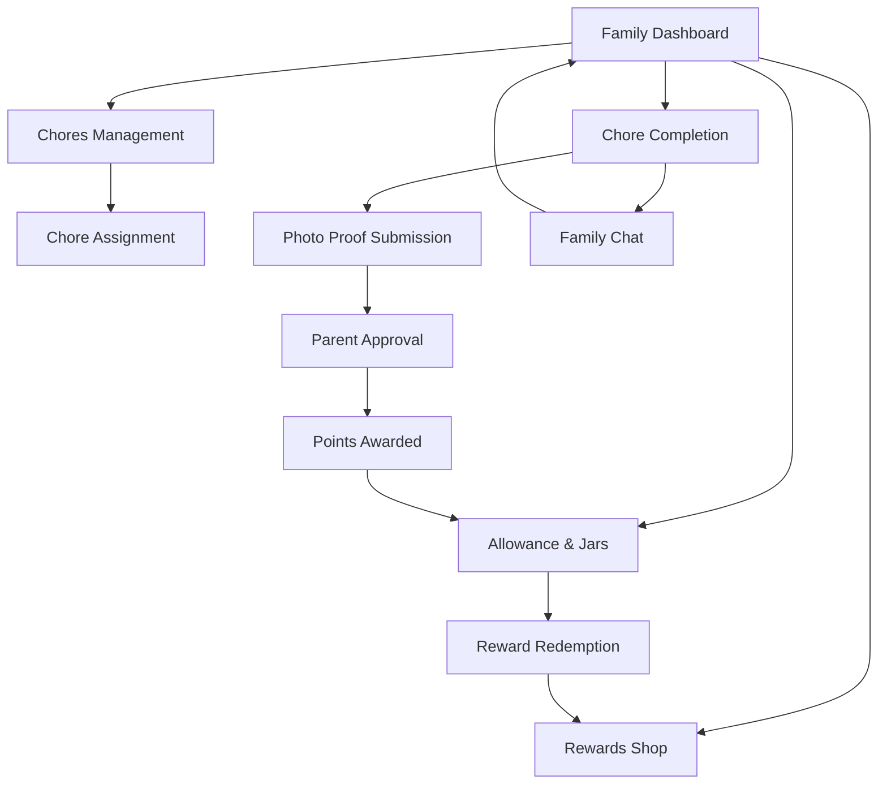

## 1. Product Overview
OpenHome is an open-source, Docker-hostable Progressive Web App (PWA) designed to make family chore management engaging and educational. The app teaches children financial responsibility through completing chores while providing parents with tools to manage household tasks and allowances effectively.

The app connects families by gamifying chore completion, teaching kids that money is earned through work, and helping parents track household responsibilities. OpenHome promotes financial literacy through a three-jar system (Spend/Save/Give) and includes features for photo proof, parent approval, and family communication.

Target market: Families with children aged 5-16 who want to teach financial responsibility through household chores in a fun, engaging way.

## 2. Core Features

### 2.1 User Roles
| Role | Registration Method | Core Permissions |
|------|---------------------|------------------|
| Parent | Email registration + Family PIN creation | Full family management, chore creation, allowance management, approval workflows |
| Child | Parent invitation + PIN login | View assigned chores, submit completion proof, manage allowance jars, earn rewards |

### 2.2 Feature Module
Our OpenHome requirements consist of the following main pages:
1. **Family Dashboard**: Overview of all family members, pending chores, recent activities, and family announcements.
2. **Chores Management**: Create/edit recurring and one-time chores, assign to family members, set rewards and deadlines.
3. **Chore Completion**: Photo proof submission, parent approval workflow, completion tracking with gamification.
4. **Allowance & Jars**: Three-jar system (Spend/Save/Give), allowance tracking, transaction history, goal setting.
5. **Rewards Shop**: Family-created rewards catalog, point redemption system, achievement badges and streaks.
6. **Family Chat**: In-app messaging system for chore-related communication and family announcements.
7. **Settings & Profile**: User profiles, family settings, notification preferences, offline sync configuration.

### 2.3 Page Details
| Page Name | Module Name | Feature description |
|-----------|-------------|---------------------|
| Family Dashboard | Family Overview | Display all family members with avatar cards showing current points, pending chores count, and streak status. Show recent family activity feed with chore completions and achievements. |
| Family Dashboard | Quick Actions | Floating action button for quick chore creation, allowance distribution, and family announcements. |
| Chores Management | Chore Creator | Create chores with title, description, photos, recurring schedule (daily/weekly/monthly), point value, and assign to family members. Set difficulty levels and age-appropriate filters. |
| Chores Management | Assignment System | Drag-and-drop interface to assign chores to family members, set deadlines, and create chore templates for common household tasks. |
| Chore Completion | Photo Proof | Camera integration for before/after photos, drawing tools for highlighting completed areas, and parent approval workflow with comments. |
| Chore Completion | Gamification Elements | Progress bars, achievement badges, streak counters, celebration animations, and point accumulation with sound effects. |
| Allowance & Jars | Three-Jar System | Visual representation of Spend/Save/Give jars with animated coin deposits, percentage breakdowns, and goal tracking for savings. |
| Allowance & Jars | Transaction History | Detailed log of all allowance transactions, chore earnings, spending, and transfers between jars with filtering options. |
| Rewards Shop | Family Rewards | Parents create custom rewards (screen time, special activities, toys) with point costs, and children browse and redeem available rewards. |
| Rewards Shop | Achievement System | Unlockable badges for milestones (first chore, streak master, saver champion), leaderboard for family competition, and celebration screens. |
| Family Chat | Communication Hub | Threaded discussions per chore, family announcement channel, emoji reactions, and photo sharing within conversations. |
| Settings & Profile | User Management | Avatar customization, PIN security settings, notification preferences, and family member invitation system. |

## 3. Core Process

### Parent User Flow
1. **Setup**: Parent creates family account, sets family PIN, adds family members with roles and ages
2. **Chore Creation**: Parent creates chores with descriptions, photos, schedules, and point values
3. **Assignment**: Parent assigns chores to children with deadlines and special instructions
4. **Monitoring**: Parent reviews submitted chores, approves/rejects with feedback, and distributes allowance
5. **Reward Management**: Parent creates family rewards, approves redemptions, and celebrates achievements

### Child User Flow
1. **Login**: Child logs in with family PIN and personal avatar selection
2. **Chore Discovery**: Child views assigned chores with photo examples and completion instructions
3. **Completion**: Child takes before/after photos, adds completion notes, and submits for approval
4. **Earnings**: Child watches points accumulate in real-time and tracks progress toward goals
5. **Spending**: Child browses reward shop, redeems points for rewards, and manages allowance jars

## 4. User Interface Design

### 4.1 Design Style
- **Primary Colors**: Bright Teal (#00CED1), Fresh Green (#32CD32), Warm Orange (#FFA500)
- **Secondary Colors**: Soft Purple (#9370DB), Sunny Yellow (#FFD700), Coral Pink (#FF6B6B)
- **Button Style**: Rounded corners with 3D shadow effects, large touch targets (minimum 44px)
- **Typography**: Friendly rounded fonts (Nunito/Quicksand), large readable sizes (16px+ body text)
- **Layout**: Card-based design with generous white space, bottom navigation for mobile-first approach
- **Icons**: Colorful emoji-style icons, family-friendly illustrations, animated micro-interactions
- **Animations**: Bouncy spring animations, confetti celebrations, smooth page transitions

### 4.2 Page Design Overview
| Page Name | Module Name | UI Elements |
|-----------|-------------|-------------|
| Family Dashboard | Family Cards | Circular avatar photos with colorful borders, animated point counters, streak flame icons, and chore progress rings. |
| Chores Management | Chore Cards | Photo-based chore cards with difficulty stars, point badges, and assignee avatars. Drag-and-drop handles with haptic feedback. |
| Chore Completion | Photo Interface | Full-screen camera mode with overlay guides, before/after comparison slider, and approval status with animated checkmarks. |
| Allowance & Jars | Jar Visualization | 3D-style transparent jars with floating coins, percentage fill indicators, and goal milestone markers. |
| Rewards Shop | Reward Grid | Colorful product cards with point costs, availability status, and redemption animations with particle effects. |

### 4.3 Responsiveness
- **Mobile-First Design**: Optimized for smartphones with thumb-friendly navigation
- **Tablet Optimization**: Enhanced layouts for larger screens with split-view options
- **Desktop Adaptation**: Full-featured web interface with drag-and-drop capabilities
- **Touch Interactions**: Swipe gestures, long-press menus, pull-to-refresh functionality
- **Offline Indicators**: Visual cues when app is offline with cached data availability

### 4.4 PWA-Specific Features
- **App-Like Experience**: Native app feel with smooth animations and transitions
- **Home Screen Installation**: Custom app icon and splash screen for mobile devices
- **Push Notifications**: Chore reminders, completion celebrations, and family announcements
- **Background Sync**: Automatic data synchronization when connection returns
- **Service Worker**: Offline functionality with cached chore data and user progress