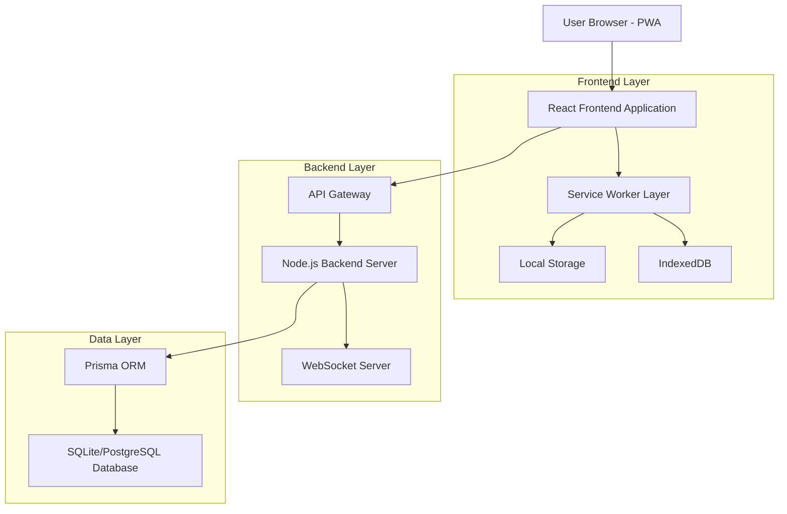
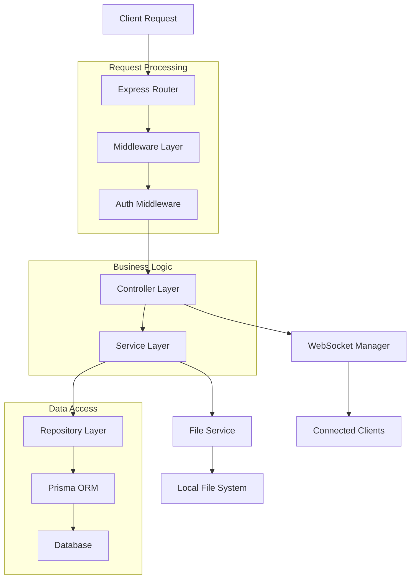
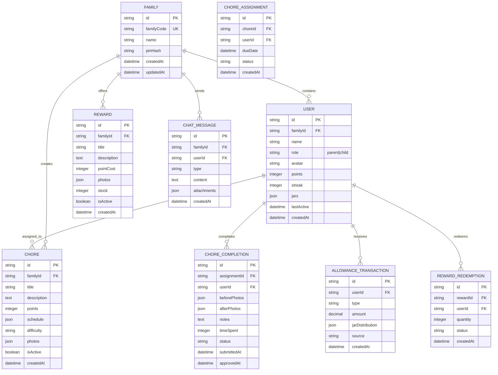

## 1. Architecture Design



## 2. Technology Description

- **Frontend**: React@18 + Vite + Tailwind CSS + shadcn/ui + PWA capabilities
- **Initialization Tool**: vite-init
- **Backend**: Node.js@20 + Express@4 + Prisma ORM
- **Database**: SQLite (development) / PostgreSQL (production)
- **Real-time**: Socket.io for live updates
- **Authentication**: JWT with family PIN system
- **File Storage**: Local file system with Docker volumes
- **PWA Features**: Service Workers, Web App Manifest, Push Notifications

### Key Dependencies
```json
{
  "frontend": {
    "react": "^18.2.0",
    "vite": "^5.0.0",
    "tailwindcss": "^3.4.0",
    "@vite-pwa/vite-plugin": "^0.17.0",
    "socket.io-client": "^4.7.0",
    "react-router-dom": "^6.20.0",
    "lucide-react": "^0.300.0"
  },
  "backend": {
    "express": "^4.18.0",
    "prisma": "^5.7.0",
    "socket.io": "^4.7.0",
    "jsonwebtoken": "^9.0.0",
    "bcryptjs": "^2.4.3",
    "multer": "^1.4.5",
    "cors": "^2.8.5"
  }
}
```

## 3. Route Definitions

| Route | Purpose |
|-------|---------|
| `/` | Family Dashboard - Main overview with family member cards and activity feed |
| `/login` | Family PIN login screen with avatar selection |
| `/chores` | Chores management interface for creating and assigning tasks |
| `/chores/:id` | Individual chore details with photo proof submission |
| `/allowance` | Allowance and three-jar system management |
| `/rewards` | Family rewards shop with redemption interface |
| `/chat` | Family communication hub with threaded discussions |
| `/profile` | User profile and settings management |
| `/offline` | Offline mode indicator with cached data access |

### API Routes
| Route | Method | Purpose |
|-------|--------|---------|
| `/api/auth/login` | POST | Family authentication with PIN |
| `/api/auth/refresh` | POST | Refresh JWT token |
| `/api/families` | GET/POST | Family creation and management |
| `/api/chores` | GET/POST/PUT/DELETE | Chore CRUD operations |
| `/api/chores/:id/complete` | POST | Submit chore completion with photos |
| `/api/chores/:id/approve` | POST | Parent approval workflow |
| `/api/allowance` | GET/POST | Allowance distribution and jar management |
| `/api/rewards` | GET/POST/PUT/DELETE | Rewards catalog management |
| `/api/rewards/:id/redeem` | POST | Reward redemption processing |
| `/api/chat` | GET/POST | Family chat messages |
| `/api/users` | GET/PUT | User profile management |

## 4. API Definitions

### 4.1 Authentication APIs

**Family Login**
```
POST /api/auth/login
```

Request:
| Param Name | Param Type | isRequired | Description |
|------------|------------|------------|-------------|
| familyCode | string | true | Unique family identifier |
| pin | string | true | 4-6 digit family PIN |
| userId | string | false | Specific user for child login |

Response:
```json
{
  "token": "eyJhbGciOiJIUzI1NiIsInR5cCI6IkpXVCJ9...",
  "refreshToken": "refresh_token_string",
  "family": {
    "id": "family_uuid",
    "name": "The Johnson Family",
    "members": [...]
  },
  "user": {
    "id": "user_uuid",
    "name": "Emma",
    "role": "child",
    "avatar": "🧒"
  }
}
```

### 4.2 Chore Management APIs

**Create Chore**
```
POST /api/chores
```

Request:
| Param Name | Param Type | isRequired | Description |
|------------|------------|------------|-------------|
| title | string | true | Chore name |
| description | string | true | Detailed instructions |
| points | number | true | Point value for completion |
| schedule | object | true | Recurring schedule details |
| assignees | array | true | User IDs assigned |
| difficulty | string | false | Easy/Medium/Hard |
| photos | array | false | Reference photos URLs |

**Submit Chore Completion**
```
POST /api/chores/:id/complete
```

Request:
| Param Name | Param Type | isRequired | Description |
|------------|------------|------------|-------------|
| beforePhotos | array | true | Before completion photos |
| afterPhotos | array | true | After completion photos |
| notes | string | false | Completion notes |
| timeSpent | number | false | Time in minutes |

### 4.3 Allowance APIs

**Distribute Allowance**
```
POST /api/allowance/distribute
```

Request:
| Param Name | Param Type | isRequired | Description |
|------------|------------|------------|-------------|
| amount | number | true | Total allowance amount |
| distribution | object | true | Jar distribution percentages |
| notes | string | false | Optional notes |

Response:
```json
{
  "transactionId": "txn_uuid",
  "distributedTo": [
    {
      "userId": "child_uuid",
      "amount": 10.00,
      "jars": {
        "spend": 5.00,
        "save": 3.00,
        "give": 2.00
      }
    }
  ],
  "timestamp": "2024-01-15T10:30:00Z"
}
```

## 5. Server Architecture Diagram



## 6. Data Model

### 6.1 Entity Relationship Diagram



### 6.2 Data Definition Language

**Family Table**
```sql
-- Create family table
CREATE TABLE families (
    id UUID PRIMARY KEY DEFAULT gen_random_uuid(),
    family_code VARCHAR(10) UNIQUE NOT NULL,
    name VARCHAR(100) NOT NULL,
    pin_hash VARCHAR(255) NOT NULL,
    created_at TIMESTAMP WITH TIME ZONE DEFAULT NOW(),
    updated_at TIMESTAMP WITH TIME ZONE DEFAULT NOW()
);

-- Create index for family code lookup
CREATE INDEX idx_families_family_code ON families(family_code);
```

**Users Table**
```sql
-- Create users table
CREATE TABLE users (
    id UUID PRIMARY KEY DEFAULT gen_random_uuid(),
    family_id UUID NOT NULL REFERENCES families(id) ON DELETE CASCADE,
    name VARCHAR(50) NOT NULL,
    role VARCHAR(10) NOT NULL CHECK (role IN ('parent', 'child')),
    avatar VARCHAR(10) DEFAULT '👤',
    points INTEGER DEFAULT 0,
    streak INTEGER DEFAULT 0,
    jars JSONB DEFAULT '{"spend": 0, "save": 0, "give": 0}',
    last_active TIMESTAMP WITH TIME ZONE DEFAULT NOW(),
    created_at TIMESTAMP WITH TIME ZONE DEFAULT NOW(),
    updated_at TIMESTAMP WITH TIME ZONE DEFAULT NOW()
);

-- Create indexes
CREATE INDEX idx_users_family_id ON users(family_id);
CREATE INDEX idx_users_role ON users(role);
```

**Chores Table**
```sql
-- Create chores table
CREATE TABLE chores (
    id UUID PRIMARY KEY DEFAULT gen_random_uuid(),
    family_id UUID NOT NULL REFERENCES families(id) ON DELETE CASCADE,
    title VARCHAR(100) NOT NULL,
    description TEXT,
    points INTEGER NOT NULL DEFAULT 10,
    schedule JSONB NOT NULL,
    difficulty VARCHAR(10) DEFAULT 'medium' CHECK (difficulty IN ('easy', 'medium', 'hard')),
    photos JSONB DEFAULT '[]',
    is_active BOOLEAN DEFAULT true,
    created_at TIMESTAMP WITH TIME ZONE DEFAULT NOW(),
    updated_at TIMESTAMP WITH TIME ZONE DEFAULT NOW()
);

-- Create indexes
CREATE INDEX idx_chores_family_id ON chores(family_id);
CREATE INDEX idx_chores_is_active ON chores(is_active);
```

**Chore Assignments Table**
```sql
-- Create chore assignments table
CREATE TABLE chore_assignments (
    id UUID PRIMARY KEY DEFAULT gen_random_uuid(),
    chore_id UUID NOT NULL REFERENCES chores(id) ON DELETE CASCADE,
    user_id UUID NOT NULL REFERENCES users(id) ON DELETE CASCADE,
    due_date TIMESTAMP WITH TIME ZONE,
    status VARCHAR(20) DEFAULT 'pending' CHECK (status IN ('pending', 'in_progress', 'completed', 'approved', 'rejected')),
    created_at TIMESTAMP WITH TIME ZONE DEFAULT NOW(),
    UNIQUE(chore_id, user_id, due_date)
);

-- Create indexes
CREATE INDEX idx_assignments_user_id ON chore_assignments(user_id);
CREATE INDEX idx_assignments_status ON chore_assignments(status);
CREATE INDEX idx_assignments_due_date ON chore_assignments(due_date);
```

**Docker Configuration**
```dockerfile
# Frontend Dockerfile
FROM node:20-alpine AS frontend
WORKDIR /app
COPY package*.json ./
RUN npm install
COPY . .
RUN npm run build

# Backend Dockerfile
FROM node:20-alpine AS backend
WORKDIR /app
COPY package*.json ./
RUN npm install
COPY . .
EXPOSE 3001
CMD ["npm", "start"]

# Production Docker Compose
version: '3.8'
services:
  frontend:
    build:
      context: ./frontend
      dockerfile: Dockerfile
    ports:
      - "3000:3000"
    environment:
      - VITE_API_URL=http://backend:3001
    depends_on:
      - backend
  
  backend:
    build:
      context: ./backend
      dockerfile: Dockerfile
    ports:
      - "3001:3001"
    environment:
      - DATABASE_URL=postgresql://user:pass@db:5432/openhome
      - JWT_SECRET=your-secret-key
    volumes:
      - ./uploads:/app/uploads
    depends_on:
      - db
  
  db:
    image: postgres:15
    environment:
      - POSTGRES_DB=openhome
      - POSTGRES_USER=user
      - POSTGRES_PASSWORD=pass
    volumes:
      - postgres_data:/var/lib/postgresql/data

volumes:
  postgres_data:
```